# Energiekuchen - Software Design Document

## 1. Introduction and Overview

### 1.1 Purpose
This Software Design Document provides a comprehensive technical specification for the Energiekuchen web application. It serves as a technical blueprint for developers to understand the architecture, design decisions, and implementation details required to build a robust energy visualization tool.

### 1.2 Scope
This document covers:
- Complete system architecture using Next.js App Router
- Component-based design patterns and state management
- Data modeling and local persistence strategies
- URL-based sharing system implementation
- Responsive and accessible user interface design
- Performance optimization and testing strategies

### 1.3 Project Overview
Energiekuchen is a client-side web application that helps German-speaking users visualize and balance their energy distribution through dual interactive pie charts. The application enables users to:
- Create and manage positive energy sources (activities that give energy)
- Track negative energy drains (activities that consume energy)
- Share their energy profiles via URL-encoded data
- Export and import their configurations
- Maintain data locally without server dependencies

### 1.4 Technology Stack
- **Frontend Framework:** Next.js 15.x with App Router
- **UI Library:** React 19.x with TypeScript
- **Styling:** Tailwind CSS 4.x with responsive design
- **Data Visualization:** Chart.js with react-chartjs-2
- **State Management:** React Context API with useReducer
- **Icons:** Heroicons for consistent iconography
- **Notifications:** react-hot-toast for user feedback
- **QR Code Generation:** qrcode library
- **Color Management:** react-colorful for color selection

## 2. System Architecture

### 2.1 Architecture Overview

The Energiekuchen application follows a client-side architecture pattern with Next.js App Router, providing a static export capability for deployment without server requirements. The architecture emphasizes separation of concerns, reusable components, and efficient state management.

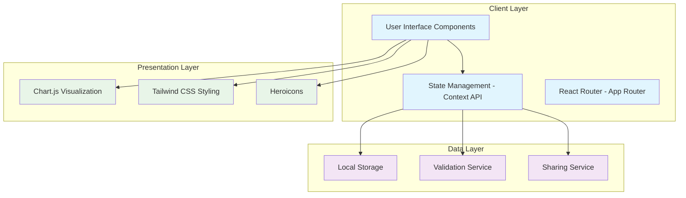

### 2.2 Application Flow

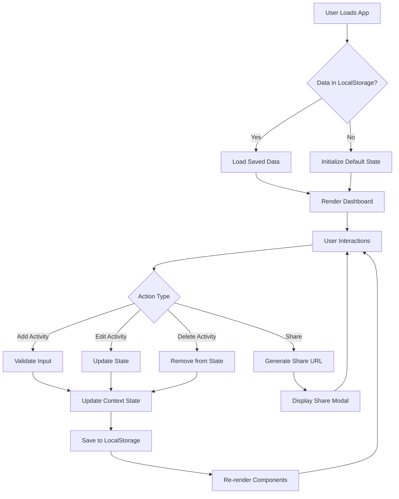

### 2.3 Directory Structure

```
/app
├── (main)/                 # Main application group
│   ├── page.tsx           # Dashboard
│   └── layout.tsx         # Main layout wrapper
├── share/
│   └── [data]/
│       └── page.tsx       # Shared chart viewer
├── hilfe/
│   └── page.tsx          # Help page
├── datenschutz/
│   └── page.tsx          # Privacy policy
├── impressum/
│   └── page.tsx          # Legal imprint
├── components/
│   ├── ui/               # Base UI components
│   │   ├── Button.tsx
│   │   ├── Input.tsx
│   │   ├── Modal.tsx
│   │   ├── Slider.tsx
│   │   ├── ColorPicker.tsx
│   │   └── Toast.tsx
│   ├── charts/           # Chart components
│   │   ├── EnergyChart.tsx
│   │   └── ChartLegend.tsx
│   ├── forms/            # Form components
│   │   └── ActivityForm.tsx
│   ├── layout/           # Layout components
│   │   └── Header.tsx
│   └── features/         # Feature-specific components
│       ├── ActivityList.tsx
│       ├── ShareModal.tsx
│       ├── SettingsModal.tsx
│       ├── ImportExportModal.tsx
│       └── HelpModal.tsx
├── lib/
│   ├── contexts/         # React Context providers
│   │   ├── EnergyContext.tsx
│   │   └── UIContext.tsx
│   ├── hooks/            # Custom React hooks
│   │   ├── useLocalStorage.ts
│   │   ├── useChartData.ts
│   │   └── useResponsive.ts
│   └── utils/            # Utility functions
│       ├── storage.ts
│       ├── sharing.ts
│       ├── validation.ts
│       ├── calculations.ts
│       ├── constants.ts
│       └── cn.ts
├── types/                # TypeScript definitions
│   ├── index.ts
│   ├── chart.ts
│   └── storage.ts
├── globals.css
├── layout.tsx           # Root layout
└── page.tsx            # Root page redirect
```

### 2.4 Component Hierarchy

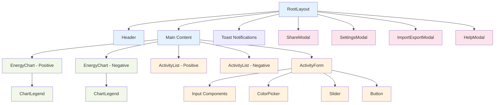

## 3. Data Design

### 3.1 Data Model Architecture

The application uses a hierarchical data model that supports the dual-chart visualization requirement while maintaining data integrity and performance.

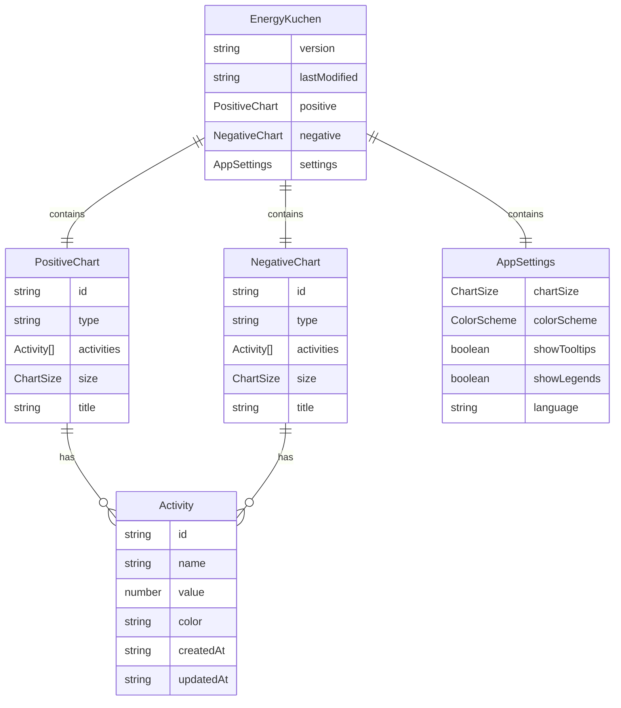

### 3.2 TypeScript Interfaces

```typescript
// types/index.ts
export interface Activity {
  id: string;
  name: string;
  value: number; // 1-100
  color: string;
  createdAt: string;
  updatedAt: string;
}

export interface EnergyChart {
  id: string;
  type: 'positive' | 'negative';
  activities: Activity[];
  size: ChartSize;
  title?: string;
}

export interface EnergyKuchen {
  version: string;
  lastModified: string;
  positive: EnergyChart;
  negative: EnergyChart;
  settings: AppSettings;
}

export interface AppSettings {
  chartSize: ChartSize;
  colorScheme: ColorScheme;
  showTooltips: boolean;
  showLegends: boolean;
  language: 'de';
}

export type ChartSize = 'small' | 'medium' | 'large';
export type ColorScheme = 'default' | 'high-contrast' | 'colorblind-friendly';

export interface ValidationResult {
  isValid: boolean;
  errors: string[];
}
```

### 3.3 Data Validation Schema

The application implements comprehensive input validation to ensure data integrity and user experience:

**Activity Validation Rules:**
- **Name**: 1-50 characters, supporting German characters, numbers, spaces, and basic punctuation
- **Value**: Integer between 1-100 representing energy intensity
- **Color**: Valid hex color code (3 or 6 digits)

**Chart Validation Rules:**
- **Maximum Activities**: 20 activities per chart (positive or negative)
- **Minimum Activities**: 0 activities (empty chart allowed)

**Input Sanitization:**
- HTML entities are escaped to prevent XSS attacks
- Special characters are validated against allowed patterns
- Numeric inputs are parsed and range-checked

### 3.4 Data Storage Strategy

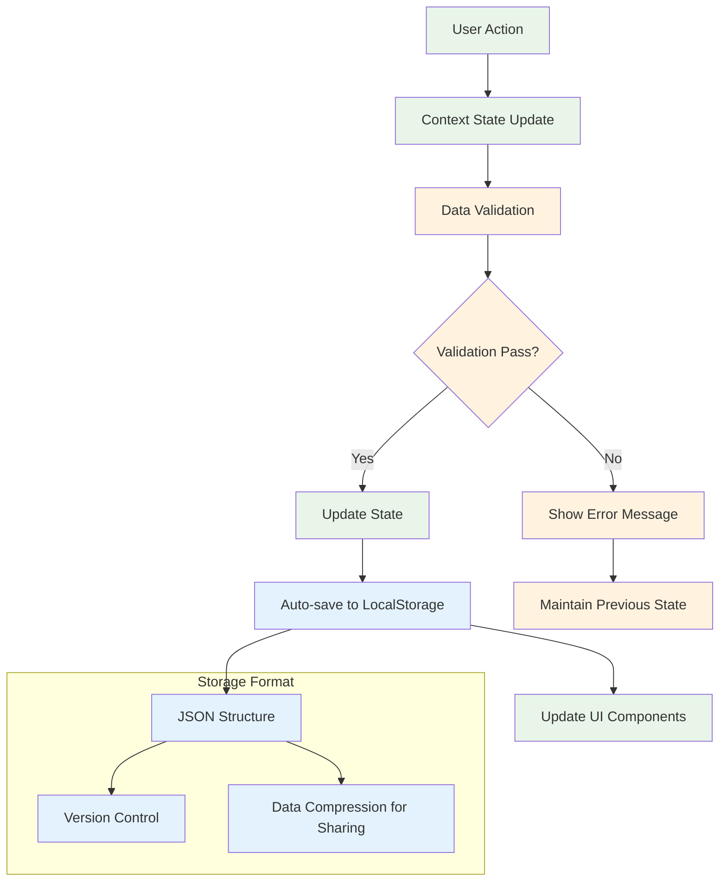

### 3.5 State Management Design

The application uses React Context API with useReducer for state management, providing a centralized store for application data while maintaining component isolation.

```typescript
// State Management Pattern
interface EnergyState {
  data: EnergyKuchen;
  isLoading: boolean;
  lastSaved: string | null;
  syncStatus: 'idle' | 'saving' | 'error';
}

type EnergyAction = 
  | { type: 'SET_DATA'; payload: EnergyKuchen }
  | { type: 'ADD_ACTIVITY'; payload: { chartType: 'positive' | 'negative'; activity: Omit<Activity, 'id' | 'createdAt' | 'updatedAt'> } }
  | { type: 'UPDATE_ACTIVITY'; payload: { chartType: 'positive' | 'negative'; activityId: string; updates: Partial<Activity> } }
  | { type: 'DELETE_ACTIVITY'; payload: { chartType: 'positive' | 'negative'; activityId: string } }
  | { type: 'UPDATE_SETTINGS'; payload: Partial<AppSettings> }
  | { type: 'RESET_DATA' };
```

## 4. Interface Design

### 4.1 API Interface Patterns

The application follows a consistent interface pattern for all major operations, ensuring predictable behavior and easy testing.

```typescript
// Storage Interface
export interface IStorageManager {
  save(data: EnergyKuchen): Promise<void>;
  load(): Promise<EnergyKuchen | null>;
  clear(): Promise<void>;
  export(): Promise<string>;
  import(data: string): Promise<EnergyKuchen>;
  isAvailable(): boolean;
}

// Sharing Interface
export interface ISharingManager {
  generateShareData(data: EnergyKuchen): Promise<ShareData>;
  decodeShareData(encoded: string): Promise<EnergyKuchen>;
  validateShareData(data: any): boolean;
  compressData(data: EnergyKuchen): Promise<string>;
}

// Validation Interface
export interface IValidationService {
  validateActivity(activity: Partial<Activity>): ValidationResult;
  validateChart(chart: Partial<EnergyChart>): ValidationResult;
  validateSettings(settings: Partial<AppSettings>): ValidationResult;
  sanitizeInput(input: string): string;
}
```

### 4.2 Component Interface Contracts

```typescript
// Chart Component Interface
export interface EnergyChartProps {
  chartType: 'positive' | 'negative';
  activities: Activity[];
  size: ChartSize;
  onActivityClick?: (activity: Activity) => void;
  onActivityHover?: (activity: Activity | null) => void;
  onActivityEdit?: (activity: Activity) => void;
  onActivityDelete?: (activityId: string) => void;
  className?: string;
  'data-testid'?: string;
}

// Form Component Interface
export interface ActivityFormProps {
  activity?: Activity;
  chartType: 'positive' | 'negative';
  onSubmit: (activity: Omit<Activity, 'id' | 'createdAt' | 'updatedAt'>) => void;
  onCancel: () => void;
  isLoading?: boolean;
  errors?: ValidationError[];
}

// Modal Component Interface
export interface ModalProps {
  isOpen: boolean;
  onClose: () => void;
  title: string;
  children: React.ReactNode;
  size?: 'sm' | 'md' | 'lg' | 'xl';
  className?: string;
}
```

### 4.3 Context API Interfaces

```typescript
// Energy Context Interface
export interface EnergyContextType {
  state: EnergyState;
  actions: {
    addActivity: (chartType: 'positive' | 'negative', activity: Omit<Activity, 'id' | 'createdAt' | 'updatedAt'>) => Promise<void>;
    updateActivity: (chartType: 'positive' | 'negative', activityId: string, updates: Partial<Activity>) => Promise<void>;
    deleteActivity: (chartType: 'positive' | 'negative', activityId: string) => Promise<void>;
    reorderActivities: (chartType: 'positive' | 'negative', fromIndex: number, toIndex: number) => Promise<void>;
    updateSettings: (settings: Partial<AppSettings>) => Promise<void>;
    resetData: () => Promise<void>;
    importData: (data: EnergyKuchen) => Promise<void>;
    exportData: () => Promise<string>;
  };
  utils: {
    getChartBalance: () => ChartBalance;
    getTotalActivities: () => number;
    getActivityById: (chartType: 'positive' | 'negative', id: string) => Activity | null;
  };
}

// UI Context Interface
export interface UIContextType {
  state: UIState;
  actions: {
    openModal: (modal: ModalType, data?: any) => void;
    closeModal: (modal: ModalType) => void;
    setEditingActivity: (chartType: 'positive' | 'negative', activityId: string) => void;
    clearEditingActivity: () => void;
    showNotification: (message: string, type: NotificationType) => void;
    setCurrentView: (view: ViewType) => void;
  };
}
```

### 4.4 Event Handling Interfaces

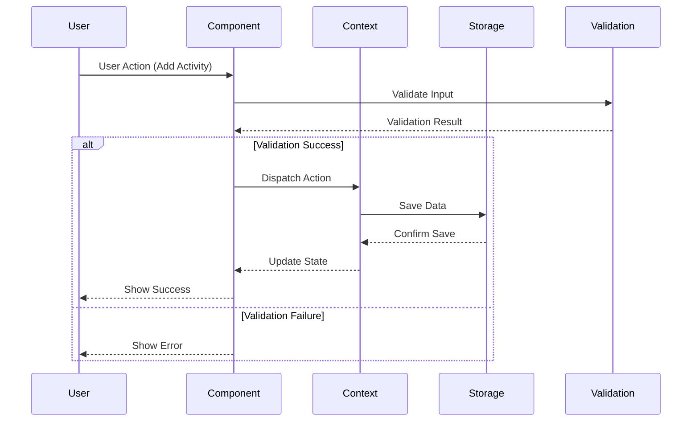

### 4.5 Error Handling Interface

```typescript
// Error Handling Interface
export interface IErrorHandler {
  handleError(error: Error, context: string): void;
  handleValidationError(errors: ValidationError[]): void;
  handleStorageError(error: StorageError): void;
  handleNetworkError(error: NetworkError): void;
  getUserMessage(error: Error): string;
  reportError(error: Error, context: ErrorContext): void;
}

// Error Types
export interface AppError extends Error {
  code: string;
  context: string;
  timestamp: string;
  userMessage: string;
}

export interface ValidationError {
  field: string;
  message: string;
  code: string;
  value?: any;
}

export interface StorageError extends AppError {
  operation: 'save' | 'load' | 'clear' | 'export' | 'import';
  data?: any;
}
```

## 5. Component Design

### 5.1 Component Architecture Pattern

The application follows a component-based architecture with clear separation of concerns, emphasizing reusability, testability, and maintainability.

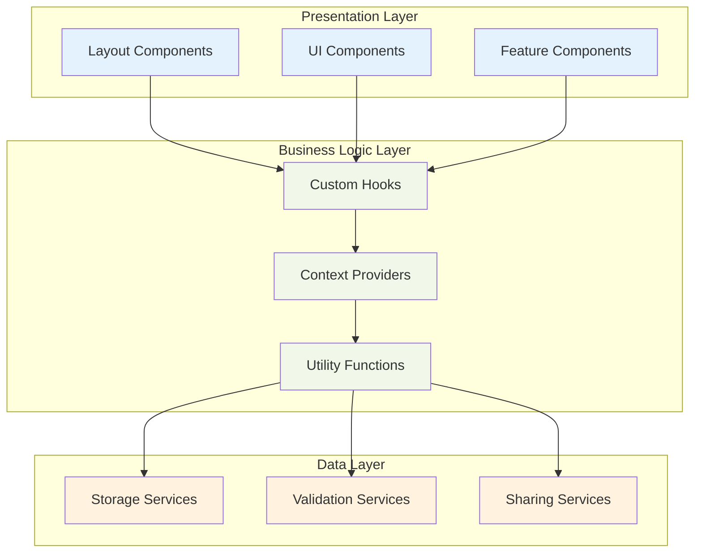

### 5.2 Core Component Specifications

#### 5.2.1 EnergyChart Component

```typescript
// Component Responsibility: Render interactive pie chart with Chart.js
export interface EnergyChartProps {
  chartType: 'positive' | 'negative';
  className?: string;
  onActivityClick?: (activityId: string) => void;
}

// State Management: Gets data from useChartData hook
// Dependencies: Chart.js, react-chartjs-2, useChartData hook
// Accessibility: ARIA labels, keyboard navigation, screen reader support
```

#### 5.2.2 ActivityForm Component

```typescript
// Component Responsibility: Handle activity creation and editing
export interface ActivityFormProps {
  chartType: 'positive' | 'negative';
  activity?: Activity;
  onSuccess?: () => void;
  onCancel?: () => void;
}

// State Management: Local form state with validation
// Dependencies: react-colorful, validation utilities
// Features: Real-time validation, color picker, energy slider
```

#### 5.2.3 ActivityList Component

```typescript
// Component Responsibility: Display and manage list of activities
export interface ActivityListProps {
  chartType: 'positive' | 'negative';
  activities: Activity[];
  className?: string;
}

// Features: Inline editing, activity management, responsive design
```

### 5.3 Custom Hooks Design

#### 5.3.1 useChartData Hook

```typescript
// Purpose: Transform activity data for Chart.js consumption
export function useChartData(
  activities: Activity[], 
  chartType: 'positive' | 'negative', 
  size: ChartSize
) {
  // Returns: { data, options, isEmpty }
  // Optimization: Memoized data transformation
  // Features: Responsive sizing, color management, accessibility labels
}
```

#### 5.3.2 useLocalStorage Hook

```typescript
// Purpose: Manage localStorage operations with React state sync
export function useLocalStorage<T>(
  key: string, 
  defaultValue: T
): [T, (value: T) => void, () => void] {
  // Returns: [value, setValue, clearValue]
  // Features: JSON serialization, error handling, SSR compatibility
}
```

#### 5.3.3 useResponsive Hook

```typescript
// Purpose: Handle responsive design breakpoints
export function useResponsive() {
  // Returns: { isMobile, isTablet, isDesktop, breakpoint }
  // Features: Window resize listening, SSR-safe implementation
}
```

### 5.4 Context Provider Architecture

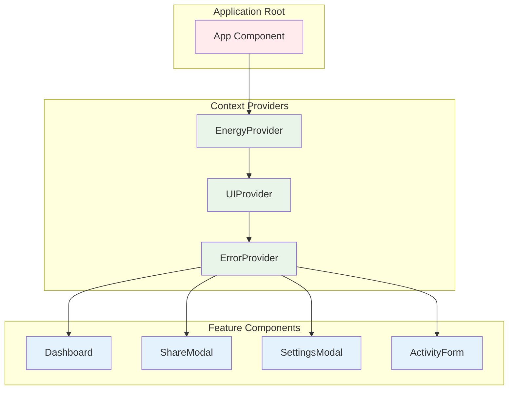

### 5.5 Component State Management Strategy

#### 5.5.1 State Categorization

```typescript
// Global State (Context API)
interface GlobalState {
  energyData: EnergyKuchen;      // Core application data
  uiState: UIState;              // Modal states, current view
  userPreferences: UserSettings;  // Settings and preferences
}

// Component State (useState/useReducer)
interface ComponentState {
  formData: FormState;           // Form inputs and validation
  animations: AnimationState;    // UI animations and transitions
  interactions: InteractionState; // User interactions and feedback
}

// Derived State (useMemo/Custom Hooks)
interface DerivedState {
  chartData: ChartData;          // Processed chart data
  validationResults: ValidationResults; // Input validation status
  calculatedMetrics: Metrics;    // Balance calculations, totals
}
```

#### 5.5.2 State Update Patterns

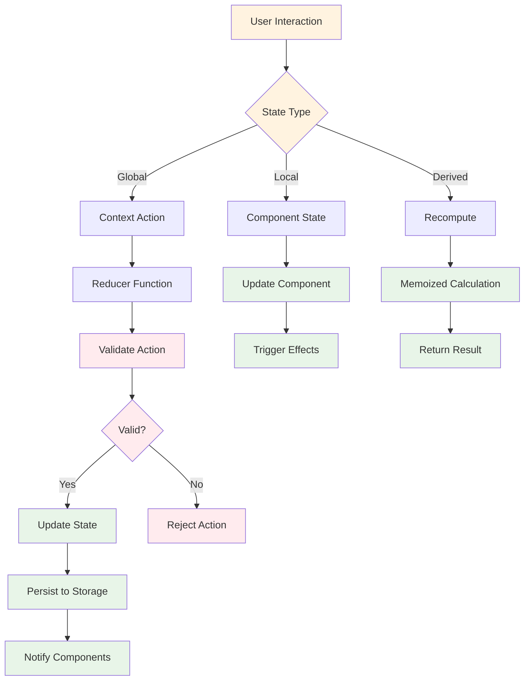

### 5.6 Component Performance Optimization

#### 5.6.1 Memoization Strategy

```typescript
// Component Memoization
const EnergyChart = React.memo(({ activities, chartType, size, ...props }) => {
  // Memoize expensive chart data calculations
  const chartData = useMemo(() => 
    generateChartData(activities, chartType), 
    [activities, chartType]
  );
  
  // Memoize chart options that depend on size
  const chartOptions = useMemo(() => 
    generateChartOptions(size), 
    [size]
  );
  
  return <Chart data={chartData} options={chartOptions} {...props} />;
});

// Callback Memoization
const ActivityList = ({ activities, onEdit, onDelete }) => {
  const handleEdit = useCallback((activity) => {
    onEdit(activity);
  }, [onEdit]);
  
  const handleDelete = useCallback((activityId) => {
    onDelete(activityId);
  }, [onDelete]);
  
  return (
    <div>
      {activities.map(activity => (
        <ActivityItem 
          key={activity.id}
          activity={activity}
          onEdit={handleEdit}
          onDelete={handleDelete}
        />
      ))}
    </div>
  );
};
```

#### 5.6.2 Code Splitting Implementation

```typescript
// Route-based code splitting
const SharePage = lazy(() => import('@/app/share/[data]/page'));
const HelpPage = lazy(() => import('@/app/hilfe/page'));
const SettingsModal = lazy(() => import('@/components/features/SettingsModal'));

// Feature-based code splitting
const ChartExport = lazy(() => import('@/components/features/ChartExport'));
const AdvancedSettings = lazy(() => import('@/components/features/AdvancedSettings'));

// Component with suspense
export function Dashboard() {
  return (
    <div>
      <EnergyChart chartType="positive" />
      <EnergyChart chartType="negative" />
      
      <Suspense fallback={<LoadingSpinner />}>
        <SettingsModal />
      </Suspense>
    </div>
  );
}
```

## 6. User Interface Design

### 6.1 Design System Architecture

The user interface follows a cohesive design system built with Tailwind CSS, emphasizing accessibility, responsiveness, and visual consistency.

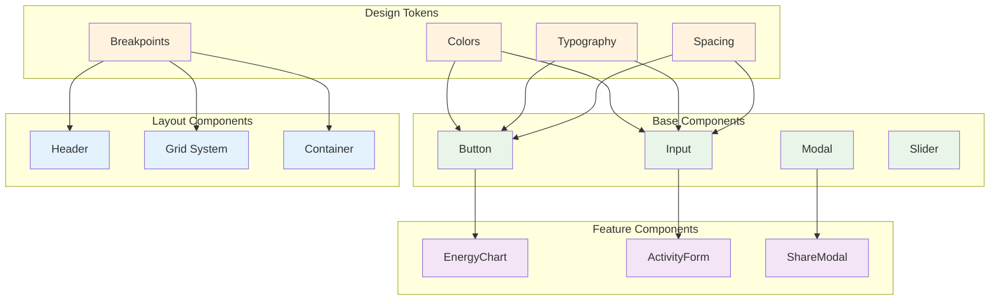

### 6.2 Visual Design Specifications

#### 6.2.1 Color Palette

The application uses a carefully designed color system that supports the energy visualization theme:

**Primary Energy Theme (Yellow/Orange):**
- Light background: `#fffbeb` - Used for subtle UI backgrounds
- Subtle accent: `#fef3c7` - For secondary elements
- Main yellow: `#fbbf24` - Primary brand color
- Active state: `#f59e0b` - Interactive element states
- Hover state: `#d97706` - Darker hover effects

**Positive Energy Colors (Green Spectrum):**
- Light background: `#dcfce7` - Chart backgrounds and highlights
- Medium green: `#4ade80` - Secondary positive elements
- Primary green: `#22c55e` - Main positive energy color
- Dark green: `#16a34a` - Strong emphasis and active states

**Negative Energy Colors (Red/Orange Spectrum):**
- Light background: `#fee2e2` - Chart backgrounds and highlights
- Medium red: `#fb7185` - Secondary negative elements
- Primary red: `#ef4444` - Main negative energy color
- Dark red: `#dc2626` - Strong emphasis and active states

**Neutral Colors (Gray Palette):**
- Ultra light: `#f9fafb` - Page backgrounds
- Light: `#f3f4f6` - Card backgrounds
- Medium light: `#d1d5db` - Borders and dividers
- Medium: `#6b7280` - Secondary text
- Dark: `#374151` - Primary text
- Very dark: `#111827` - Headings and emphasis

#### 6.2.2 Typography Scale

The typography system emphasizes readability and consistency across all device sizes:

**Font Families:**
- **Sans-serif**: Inter, system-ui, sans-serif (primary text)
- **Monospace**: JetBrains Mono, monospace (code and technical content)

**Font Sizes and Line Heights:**
- **Extra small**: 0.75rem (12px) with 1rem line height - for captions and labels
- **Small**: 0.875rem (14px) with 1.25rem line height - for secondary text
- **Base**: 1rem (16px) with 1.5rem line height - for body text
- **Large**: 1.125rem (18px) with 1.75rem line height - for emphasis
- **Extra large**: 1.25rem (20px) with 1.75rem line height - for large text
- **2X large**: 1.5rem (24px) with 2rem line height - for headings
- **3X large**: 1.875rem (30px) with 2.25rem line height - for major headings

**Font Weights:**
- **Normal** (400): Regular body text
- **Medium** (500): Subtle emphasis
- **Semi-bold** (600): Strong emphasis and labels
- **Bold** (700): Headings and important content

#### 6.2.3 Responsive Breakpoints

The responsive design system supports multiple device categories:

**Device Breakpoints:**
- **Mobile**: 320px and up - Small mobile devices
- **Tablet**: 768px and up - Tablets and large mobile devices
- **Desktop**: 1024px and up - Desktop and laptop computers
- **Wide**: 1440px and up - Large desktop displays

**Component Sizing Guidelines:**
- **Chart sizes** vary by device:
  - Mobile: Small (200px), Medium (240px), Large (280px)
  - Tablet: Small (240px), Medium (300px), Large (360px)
  - Desktop: Small (280px), Medium (360px), Large (440px)

**Touch Target Standards:**
- **Minimum**: 44px - WCAG AA compliance requirement
- **Comfortable**: 48px - Preferred touch target size for better usability

**Spacing System:**
- **Extra small**: 0.25rem (4px) - Tight spacing
- **Small**: 0.5rem (8px) - Close elements
- **Medium**: 1rem (16px) - Standard spacing
- **Large**: 1.5rem (24px) - Section spacing
- **Extra large**: 2rem (32px) - Major sections
- **2X large**: 3rem (48px) - Page-level spacing
```

### 6.3 Layout Design Patterns

#### 6.3.1 Responsive Grid System

```mermaid
graph TD
    subgraph "Mobile Layout (320px-767px)"
        A[Header - Full Width]
        B[Positive Chart - Full Width]
        C[Positive Activities - Full Width]
        D[Negative Chart - Full Width]
        E[Negative Activities - Full Width]
        F[Action Buttons - Full Width]
    end
    
    subgraph "Tablet Layout (768px-1023px)"
        G[Header - Full Width]
        H[Chart Row - Two Columns]
        I[Activities Row - Two Columns]
        J[Actions Row - Centered]
    end
    
    subgraph "Desktop Layout (1024px+)"
        K[Header - Full Width]
        L[Main Grid - Two Columns with Sidebar]
        M[Chart Section - Primary]
        N[Controls Section - Secondary]
    end
    
    A --> B --> C --> D --> E --> F
    G --> H --> I --> J
    K --> L --> M
    L --> N
    
    classDef mobile fill:#fff3e0
    classDef tablet fill:#e8f5e8
    classDef desktop fill:#e3f2fd
    
    class A,B,C,D,E,F mobile
    class G,H,I,J tablet
    class K,L,M,N desktop
```

#### 6.3.2 Component Layout Specifications

The application uses responsive layout patterns that adapt to different screen sizes:

**Dashboard Layout:**
- **Mobile**: Single column with vertical spacing (4px padding, 24px gaps)
- **Tablet**: Two-column grid with moderate spacing (24px padding, 24px gaps)
- **Desktop**: Three-column grid with generous spacing (32px padding, 32px gaps)

**Chart Section Layout:**
- **Mobile**: Centered column with tight spacing (16px between elements)
- **Tablet**: Centered column with moderate spacing (24px between elements)
- **Desktop**: Centered column with generous spacing (32px between elements)

**Activity List Layout:**
- **Mobile**: Compact vertical list (8px spacing)
- **Tablet**: Comfortable vertical list (12px spacing)
- **Desktop**: Spacious vertical list (16px spacing)

**Modal Layout:**
- **Mobile**: Full-screen modal with small margins (16px inset)
- **Tablet**: Large modal with moderate margins (32px inset)
- **Desktop**: Constrained modal with large margins (64px inset, max-width container)

### 6.4 Accessibility Design Standards

#### 6.4.1 WCAG 2.1 AA Compliance

The application meets Web Content Accessibility Guidelines (WCAG) 2.1 AA standards:

**Color Contrast Requirements:**
- **Normal text**: Minimum 4.5:1 contrast ratio
- **Large text**: Minimum 3.0:1 contrast ratio  
- **Graphics and UI elements**: Minimum 3.0:1 contrast ratio

**Focus Indicators:**
- **Outline width**: 2px visible border
- **Outline color**: Blue (#3b82f6) for consistent recognition
- **Outline offset**: 2px spacing from element
- **Border radius**: 0.375rem for rounded appearance

**ARIA Labels and Descriptions:**
- **Charts**: "Energiediagramm mit {count} Aktivitäten"
- **Activities**: "{name} Aktivität mit Wert {value}"
- **Buttons**: "{action} Button" with clear action description
- **Modals**: "{title} Modal Dialog" with descriptive titles

**Keyboard Navigation Support:**
- **Tab order**: Sequential and logical navigation
- **Skip links**: Available for main content areas
- **Modal trapping**: Focus contained within open modals
- **Escape key**: Closes modals and cancels actions

#### 6.4.2 Screen Reader Support

The application provides comprehensive screen reader optimization:

**Live Regions for Dynamic Content:**
- **Announcements**: Polite announcements (`aria-live="polite"`) for status updates
- **Alerts**: Assertive alerts (`aria-live="assertive"`) for important notifications
- **Status updates**: Atomic status regions that announce complete content changes

**Descriptive Text for UI Elements:**
- **Charts**: "Kreisdiagramm zeigt Energieverteilung" - describes chart purpose
- **Activities**: "Aktivität {name} mit {value} Energiepunkten" - details activity values
- **Forms**: "Formular zum {action} einer Aktivität" - explains form purpose
- **Buttons**: "Schaltfläche für {action}" - clarifies button functionality

**Semantic Landmarks:**
- **Main content**: `<main>` element for primary application content
- **Navigation**: `<nav>` element for menu and navigation areas
- **Banner**: `<header>` element for page header and branding
- **Content info**: `<footer>` element for footer information
- **Complementary**: `<aside>` element for secondary content

### 6.5 Animation and Interaction Design

#### 6.5.1 Animation Specifications

The animation system provides smooth, performant interactions:

**Transition Timing:**
- **Fast**: 150ms ease-in-out for immediate feedback (button presses, toggles)
- **Normal**: 250ms ease-in-out for standard transitions (modal opens, page changes)
- **Slow**: 350ms ease-in-out for complex animations (large content changes)

**Chart Animations:**
- **Entry animation**: 800ms ease-out with 100ms delay for staggered appearance
- **Update animation**: 500ms ease-in-out for data changes
- **Hover effects**: 200ms with 1.05x scale for interactive feedback

**Modal Animations:**
- **Backdrop**: Blur effect with opacity transition over 300ms
- **Panel**: Transform and opacity changes over 300ms ease-out
- **Enter state**: Full scale (100%) and opacity for visibility
- **Exit state**: Reduced scale (95%) and fade out for smooth dismissal

**Micro-interactions:**
- **Button press**: Scale down to 95% over 100ms for tactile feedback
- **Card hover**: Shadow elevation over 200ms for depth perception
- **Input focus**: Ring effect and color transition over 150ms for clear focus indication

#### 6.5.2 User Feedback Systems

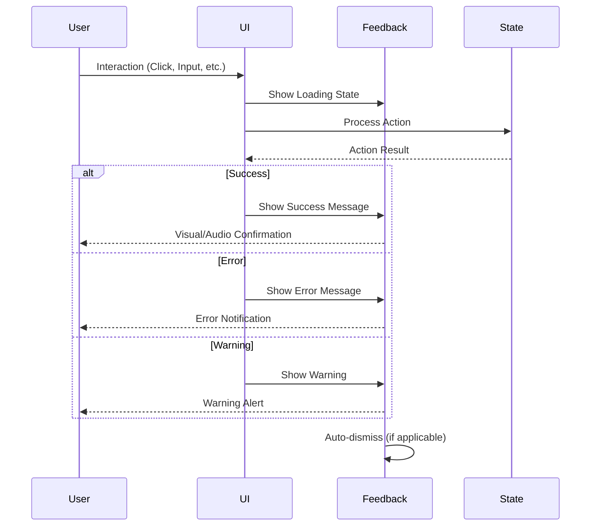

## 7. Assumptions and Dependencies

### 7.1 Technical Assumptions

#### 7.1.1 Browser and Platform Support

The application supports modern browsers with the following minimum requirements:

**Minimum Browser Versions:**
- **Chrome**: Version 90 and above
- **Firefox**: Version 88 and above
- **Safari**: Version 14 and above
- **Microsoft Edge**: Version 90 and above

**Required Browser Features:**
- **Local Storage**: Essential for data persistence across sessions
- **Canvas API**: Required for Chart.js chart rendering
- **ES2017**: Modern JavaScript features for optimal performance
- **Web Workers**: Optional feature for background data processing
- **Clipboard API**: Required for share functionality

**Performance Requirements:**
- **Minimum memory**: 512MB RAM for smooth operation
- **Local storage**: 50MB available storage for user data
- **Connection**: Works offline after initial page load

#### 7.1.2 Development Environment Assumptions

```bash
# Required Development Tools
Node.js: >= 22.0.0
npm: >= 9.0.0
TypeScript: >= 5.0.0
Next.js: >= 15.1.0

# Development OS Support
- macOS 10.15+
- Windows 10+
- Ubuntu 20.04+

# IDE/Editor Support
- VS Code (recommended)
- WebStorm
- Vim/Neovim with appropriate plugins
```

#### 7.1.3 Performance Assumptions

The application is designed to meet specific performance targets:

**Load Time Expectations:**
- **Initial load**: Less than 3 seconds for first-time visitors
- **Subsequent loads**: Less than 1 second with browser caching
- **User interactions**: Less than 100ms response time for immediate feedback

**Data Limitations:**
- **Maximum activities per chart**: 20 activities to maintain performance
- **Maximum data size**: 1MB in localStorage for user data storage
- **Maximum share URL length**: 2048 characters for browser compatibility

**Memory Usage Guidelines:**
- **Baseline memory**: Less than 50MB during normal operation
- **Peak memory**: Less than 100MB during intensive operations
- **Memory leaks**: None detected through testing and monitoring

### 7.2 External Dependencies

#### 7.2.1 Critical Production Dependencies

```json
{
  "dependencies": {
    "next": "15.1.8",
    "react": "^19.1.0",
    "react-dom": "^19.1.0",
    "typescript": "^5",
    "chart.js": "^4.4.9",
    "react-chartjs-2": "^5.3.0",
    "tailwindcss": "^4.1.7",
    "@heroicons/react": "^2.2.0",
    "react-hot-toast": "^2.5.2",
    "react-colorful": "^5.6.1",
    "qrcode": "^1.5.4",
    "clsx": "^2.1.1",
    "tailwind-merge": "^3.3.0",
    "uuid": "^11.1.0"
  }
}
```

#### 7.2.2 Development Dependencies

```json
{
  "devDependencies": {
    "@types/node": "^22",
    "@types/react": "^19",
    "@types/react-dom": "^19",
    "@types/qrcode": "^1.5.5",
    "@types/uuid": "^10.0.0",
    "eslint": "^9",
    "eslint-config-next": "15.1.8",
    "postcss": "^8.5.3",
    "@tailwindcss/postcss": "^4.1.7",
    "@eslint/eslintrc": "^3"
  }
}
```

#### 7.2.3 Dependency Risk Assessment

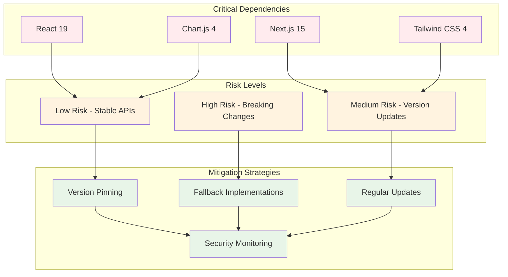

### 7.3 Infrastructure Assumptions

#### 7.3.1 Deployment Environment

The application is deployed using modern static hosting with the following configuration:

**Platform and Domain:**
- **Hosting platform**: Vercel for static site deployment
- **Domain**: energiekuchen.de for production environment

**Build Configuration:**
- **Node.js version**: 22.x for consistent build environment
- **Build command**: `npm run build` for production optimization
- **Output directory**: `out` for static file generation
- **Install command**: `npm ci` for reproducible dependency installation

**Environment Variables:**
- **NODE_ENV**: Set to 'production' for optimized builds
- **NEXT_TELEMETRY_DISABLED**: Set to '1' to disable telemetry collection

**Feature Configuration:**
- **Static export**: Enabled for client-side only operation
- **Server functions**: Disabled (not needed for client-side app)
- **Database**: Not used (localStorage only)
- **Authentication**: Not implemented (single-user application)

#### 7.3.2 Content Delivery Network

The application leverages a global CDN for optimal performance:

**CDN Provider and Strategy:**
- **Provider**: Vercel Edge Network for worldwide distribution
- **Primary regions**: Frankfurt (fra1) for German users, with Paris (cdg1) and London (lhr1) as backup

**Caching Strategy:**
- **Static assets**: 1 year cache duration for images, CSS, and JavaScript
- **HTML pages**: 1 hour cache for dynamic content updates
- **API routes**: No caching (not applicable for client-side app)

**Performance Optimizations:**
- **Image optimization**: Disabled due to static export limitations
- **Compression**: Both gzip and brotli compression enabled
- **Minification**: Enabled for CSS and JavaScript bundles
- **Bundle splitting**: Automatic code splitting for optimal loading

### 7.4 Security Assumptions

#### 7.4.1 Client-Side Security Model

The application implements a comprehensive security strategy focused on client-side protection:

**Data Storage Security:**
- **Storage location**: localStorage only, no server-side data transmission
- **Encryption**: Relies on browser-native security mechanisms
- **Data sensitivity**: Low-risk user activity preferences only
- **Privacy protection**: No personal data transmitted to external servers

**Input Validation and Sanitization:**
- **Client-side validation**: Complete input validation before processing
- **Server-side validation**: Not applicable (client-side only application)
- **Input sanitization**: HTML entity encoding and XSS prevention measures

**Data Sharing Security:**
- **Data encoding**: Base64 URL-safe encoding for share functionality
- **Compression**: LZ-string compression for large datasets in URLs
- **Validation**: Schema validation when decoding shared data
- **URL length limits**: Restricted to 2048 characters for browser compatibility

**Content Security Measures:**
- **Content Security Policy**: Strict CSP headers to prevent code injection
- **XSS protection**: React's built-in protection against cross-site scripting
- **CSRF protection**: Not applicable due to client-side only architecture
- **Clickjacking prevention**: X-Frame-Options: DENY header implementation

#### 7.4.2 Privacy Compliance

The application adheres to privacy best practices and regulatory requirements:

**Data Processing Practices:**
- **Personal data**: No personal information collected or processed
- **Analytics**: No analytics tracking implemented
- **Cookies**: No cookies used for tracking or functionality
- **User tracking**: No behavioral tracking or profiling

**User Rights and Control:**
- **Data access**: Full local access through browser developer tools
- **Data portability**: Export functionality for user data backup
- **Data deletion**: Clear data functionality to remove all stored information
- **Data modification**: Complete editing capabilities for all user content

**Legal and Regulatory Compliance:**
- **GDPR compliance**: Not applicable due to absence of data collection
- **Cookie policy**: Not required (no cookies used)
- **Privacy policy**: Informational document explaining local-only operation
- **Terms of service**: Usage guidelines and application limitations

### 7.5 Operational Assumptions

#### 7.5.1 Maintenance and Updates

The application follows a structured maintenance approach to ensure reliability and security:

**Update Frequency Guidelines:**
- **Security updates**: Applied within 48 hours of discovery or patch availability
- **Dependency updates**: Monthly review and updates for non-breaking changes
- **Feature releases**: Quarterly major releases with new functionality
- **Bug fixes**: Resolved and deployed within 1 week of confirmation

**Monitoring and Quality Assurance:**
- **Error tracking**: Client-side error boundaries to catch and handle runtime errors
- **Performance monitoring**: Core Web Vitals tracking for user experience metrics
- **User feedback**: Manual collection through help modal and contact methods
- **Uptime monitoring**: Vercel platform status monitoring for availability

**Backup and Recovery Strategy:**
- **Source code**: Git repository with distributed backup across platforms
- **User data**: User-managed through export functionality (no server-side storage)
- **Configuration**: Infrastructure as code for reproducible deployments

#### 7.5.2 Scalability Considerations

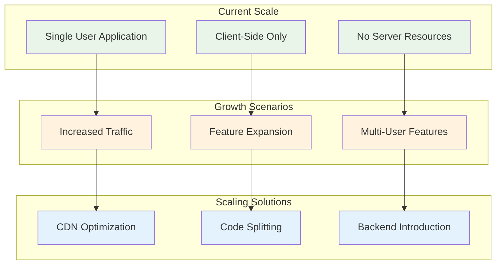
